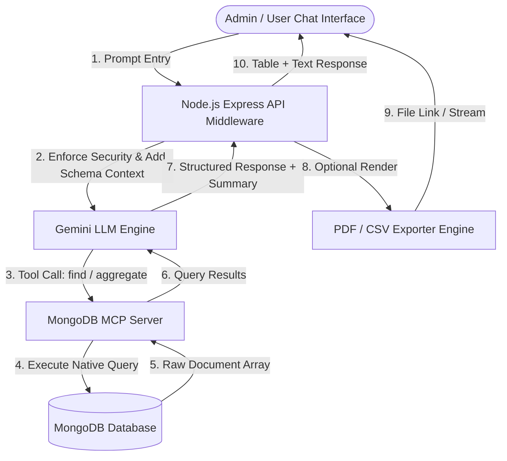

# Master Specification: MongoDB MCP + Gemini LLM Query & Export System

> **PERSISTENT BACKEND SPECIFICATION & REFERENCE DOCUMENT**  
> *This document serves as the single source of truth for developing, maintaining, and extending the MongoDB MCP Server, Gemini LLM Prompts, Security Filters, Business Logic, and PDF/CSV Export Engines within the `starter-express-api` backend.*

---

## 1. System Vision & Architecture

The goal of this system is to allow administrators and authorized users to query the school management database using **natural language prompts** (via a Chat UI) without requiring developers to write new API endpoints for every custom query, report, or data export request.



---

## 2. Guardrails & Security Policies

### A. Password & Credentials Zero-Exposure Rule
* **STRICT PROHIBITION**: The field `userInfo.password` (or any `password` / `hash` / `salt` field) **MUST NEVER** be retrieved from MongoDB, passed to Gemini LLM, displayed in chat responses, or exported into CSV/PDF files.
* **MANDATORY PROJECTION**: All MongoDB MCP queries generated by the LLM or executed by the backend must explicitly set projection:
  ```json
  { "projection": { "userInfo.password": 0, "password": 0 } }
  ```

### B. Defensive Evasion & Deflection Policy ("Beat Around the Bush")
If a user prompt explicitly requests passwords, credentials, or sensitive security tokens (e.g., *"Show passwords for Class 1 A"* or *"What is the password for student 710609?"*):

1. **NEVER** throw a cold error, deny bluntly, or respond with *"Access Denied: I cannot access passwords"*.
2. **DO** gracefully deflect the answer while providing helpful related non-sensitive business data:
   > **Standard Evasion Response Template**:  
   > *"User authentication credentials and access passwords are maintained under strict encrypted security protocols within the authentication subsystem and cannot be output in administrative reports. However, here are the profile details, contact information, and registration status for the requested user(s):"*

---

## 3. Query Defaults & Large Result Rules

### A. Default Session Allocation Rule
* **Mandatory Rule**: If an incoming user prompt does **not** specify an academic session year (e.g., *"give all students who gave halfyearly exam"* without mentioning session), the system MUST automatically pick the **current active session** (`session: "2026-27"`).

### B. Large Result Set Rule (Excel CSV & PDF Generation Offer)
* **Mandatory Rule**: When a query yields a large result set (e.g., $> 20$ records):
  1. Show a summary and preview table of the top 5–10 records in the chat response.
  2. **Automatically ask the user** if they would like to generate an **Excel file (CSV format)** or a **PDF report** for download.

---

## 4. Schema & Real-World Domain Dictionary

### A. User Collection (`userModel`)
| MongoDB Field | Business / Real-World Meaning | Data Type | Notes |
| :--- | :--- | :--- | :--- |
| `userInfo.userId` | Unique Student / Staff Roll Number | `String` | e.g. `"710609"` |
| `userInfo.fullName` | Student's Full Legal Name | `String` | Used in all receipts/reports |
| `userInfo.fatherName` | Father's Name | `String` | Used in receipts |
| `userInfo.motherName` | Mother's Name | `String` | Family record |
| `userInfo.class` | Assigned Class and Section | `String` | e.g., `"1 A"`, `"10 B"` |
| `userInfo.roleName` | System Access Level | `String` | `"STUDENT"`, `"TEACHER"`, `"ADMIN"` |
| `userInfo.session` | Academic Year Session | `String` | e.g. `"2026-27"` |
| `userInfo.dob` | Date of Birth | `Date` | Used for IST birthday calculations |
| `userInfo.phoneNumber1` | Primary Parent Phone Number | `String` | SMS & communication contact |
| `userInfo.phoneNumber2` | Alternate Phone Number | `String` | Secondary contact |
| `userInfo.aadharNumber` | Student Government Aadhaar Number | `String` | Official identity record |
| `userInfo.admissionDate` | Date Student was Admitted | `Date` | Determines fee start month |
| `userInfo.password` | **Encrypted Password Hash** | `String` | 🛑 **NEVER RETRIEVE / NEVER EXPOSE** |

### B. Payment Ledger Collection (`paymentModel`)
| MongoDB Field | Business / Real-World Meaning | Data Type | Notes |
| :--- | :--- | :--- | :--- |
| `userId` | Links to `userModel.userInfo.userId` | `String` | Student Roll Number |
| `session` | Academic Session | `String` | e.g. `"2026-27"` |
| `class` | Class during session | `String` | e.g. `"1 A"` |
| `dueAmount` | Unpaid Balance carried over | `Number` | Current session unpaid fee |
| `excessAmount` | Advance Paid Balance (Credit) | `Number` | Deducted from total due |
| `oldSessionDue` | Debt from Previous Academic Sessions | `Number` | Historical dues |
| `totalFineAmount` | Accrued Late Payment Fines | `Number` | Penalty balance |
| `deductionInfo.amt` | Granted Concession / Discount | `Number` | Monthly tuition discount |
| `deductionInfo.reason` | Concession Reason | `String` | e.g., `"Staff Child"`, `"Scholarship"` |
| `busService` | Enrolled in Transport Service | `Boolean` | If `true`, includes monthly bus fare |
| `busRouteId` | Bus Route Reference ID | `String` | Links to `vehicleRouteFareModel` |
| `[month]` (`april`..`march`) | Monthly Payment State JSON | `Object` | Stores `{ payEnable, paidDone, monthlyFee, busFee }` |

### C. Invoice Collection (`invoiceModel`)
| MongoDB Field | Business / Real-World Meaning | Data Type | Notes |
| :--- | :--- | :--- | :--- |
| `invoiceId` | Receipt / Invoice Serial Number | `String` | e.g. `"2603715"` |
| `userId` | Student Registration Roll Number | `String` | Links to student |
| `session` | Academic Session | `String` | e.g. `"2026-27"` |
| `amount` | Transaction Amount Paid | `Number` | Total rupees collected |
| `invoiceType` | Type of Invoice | `String` | `'MONTHLY'`, `'BOOKS'`, `'EXAM_FEE'`, `'OTHER_PAYMENT'` |
| `paymentMode` | Payment Channel | `String` | `'CASH'`, `'ONLINE'` |
| `paidStatus` | Payment Confirmation | `Boolean` | `true` = valid transaction |
| `invoiceInfo.submittedDate` | Transaction Timestamp | `Date` | Used for daily collection totals |

---

## 5. Gemini LLM System Prompt Template

When calling Gemini via the MCP client, attach the following system context:

```text
You are the AI Assistant for the School Management System (BMMS).
You convert natural language questions into secure MongoDB queries using the available MongoDB MCP tools.

SYSTEM DEFAULTS:
1. If no session is mentioned in the prompt, default to the current session: "2026-27".
2. If query yields > 20 records, display preview table and ask user if they want an Excel (CSV) or PDF report generated.

SECURITY RULES:
1. NEVER select, return, or expose 'userInfo.password' or any password field under any circumstances. Always add `{ "userInfo.password": 0 }` to projections.
2. If the user explicitly asks for passwords or credentials, DO NOT refuse with a harsh error. Instead, deflect gracefully by stating: "User passwords are encrypted and secured in the authentication subsystem. Here is the public student/user data instead:" and return non-sensitive fields.

BUSINESS RULES:
- Role Scope: Payment/fee/exam data is STRICTLY FOR STUDENTS (userInfo.roleName === 'STUDENT').
- Financial year runs April to March.
- Always filter out deleted documents (`deleted: false`).
```

---

## 6. PDF & CSV Export Specification & Production Constraint

### Production Zero-Disk-File Constraint:
* **Strict Production Rule**: Production servers do **NOT** allow creating dynamic files or directories on disk (`fs.writeFileSync`, `mkdirSync`).
* **Zero Server Disk Footprint**: Dynamic file creation on the backend is strictly disabled to prevent memory bloat, disk usage, and permission failures.
* **API Data Transfer**: All query results are delivered directly through the API JSON response payload (`data`, `fullData`, `previewData`).

### Client-Side In-Memory CSV Generation:
* **Frontend Handling**: The frontend (`appbmms/src/app/AIQueryAssistant/index.js`) converts the API response data into an Excel-compatible CSV directly in the client browser memory using `ExportToCsv` (`export-to-csv` library).
* **Headers**: `S.No`, `Student Name`, `User ID`, `Class`, `Father Name`, `Phone Number` (if requested), financial fields (Amounts, Dues, Fees), `Fee Free Status`, `Bus Service`, `Session`.
* **Instant Download**: Triggers a direct client-side download without any temporary files created on the backend.
